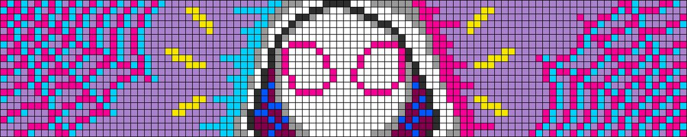
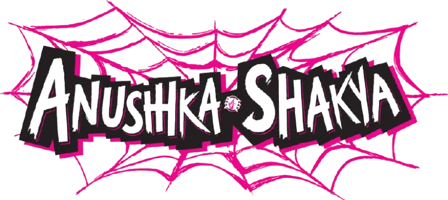

  
  

👾 I work on machine learning, local LLM applications, and AI systems.

---

#### 🌀 Projects

| AI & Machine Learning | Other |
| --------------------- | ----- |
| • **Sentinel AI** – Estimates transformer reliability using uncertainty estimation and ensemble disagreement. · [Repo](https://github.com/furged/meta-model-failure-prediction) · [Demo](https://huggingface.co/spaces/furged/sentinal-ai)  • **Neural Surrogate Modeling** – Fourier Neural Operator for solving the 2D Heat Equation. · [Repo](https://github.com/furged/neuro-surrogate-ds)  • **Native RAG** *(In Progress)* – Browser-native Retrieval-Augmented Generation with local embeddings, PDF ingestion, and IndexedDB vector storage. · [Repo](https://github.com/furged/browser-rag) | • **qrception** – A QR code. It moves. It changes colors. That's all you're getting. · [Repo](https://github.com/furged/qrception) · [Demo](https://qrception.vercel.app/)  • **Connect 4** – Classic Connect Four built with Pygame and NumPy. · [Repo](https://github.com/furged/Connect-four-game)  • **Pong** – Browser-based Pong game built with HTML5 Canvas and JavaScript. · [Repo](https://github.com/furged/Pong-game) · [Demo](https://furged-pong.vercel.app/) |

#### 🌀 Stuff I Use

| | |
| --- | --- |
| **Languages** |    |
| **AI / ML** |      |
| **Data Science** |     |
| **Web** |      |
| **Tools** |      |
---

#### 🌀 Let's Connect

